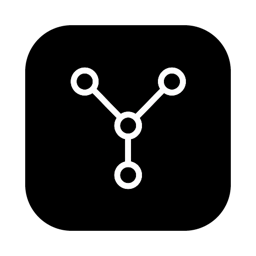
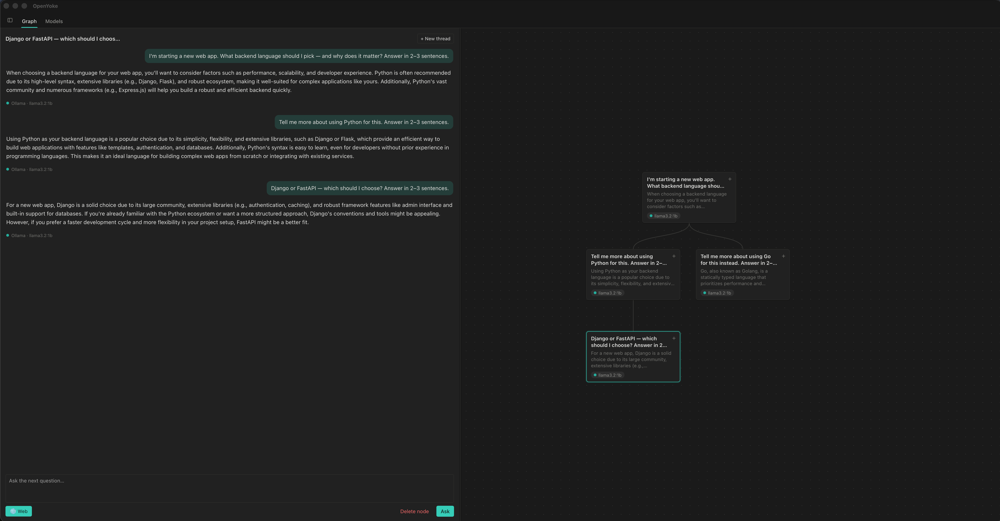

<div align="center">



# OpenYoke

### A private, local-first desktop app for chatting with open-source AI models — with branching conversations you explore as a visual graph.

OpenYoke is an open-source **Ollama desktop GUI** and **private ChatGPT alternative**. Run open models locally via Ollama — no accounts, nothing leaves your machine — *or* bring your own API key to chat with **Claude, GPT, and Gemini** when you want a frontier model. Manage models, chat with streaming responses, and branch any conversation into a tree you can navigate like a canvas.


</div>

<p align="center">
  
</p>

<p align="center"><em>Branch a conversation from any point and explore each direction as a graph — every branch keeps its own context.</em></p>

---

## Why OpenYoke?

Most local-LLM tools give you a plain chat box. OpenYoke gives you a **thinking space**:

- 🌳 **Branching conversations, not a linear log.** Every exchange is a node in a tree. Ask a follow-up, or branch off in a new direction from *any* earlier point — then see the whole shape of your thinking as an interactive, n8n-style graph.
- 🧠 **Context stays on the path.** When you branch, the model only sees the messages along that branch — sibling branches never bleed into each other. Explore competing ideas in parallel without cross-contamination.
- 🔒 **100% local and private.** Your conversations and model weights live on your machine. Nothing is sent anywhere. Perfect for sensitive work and offline use.
- 🖥️ **No terminal required.** Browse a curated model library, download models with a live progress bar, and delete them — all from inside the app.
- ⚡ **Fast and lightweight.** A native [Tauri](https://tauri.app) shell with a Rust backend. No Electron bloat, no bundled Chromium.

## Features

- 🗂️ **Branching conversation graph** — a free-drag canvas of nodes (each node is one question + answer). Pan, zoom, drag to arrange; branch from any node.
- ✍️ **Streaming responses** — tokens render live as the model generates, like the tools you already love.
- 📚 **In-app model management** — browse open models (Llama, Qwen, Mistral, Gemma, Phi, DeepSeek, and more), pull them with progress, and remove them to reclaim disk.
- 💾 **Your data, your folder** — pick where conversations and settings are saved; everything persists across restarts as plain JSON.
- 🎨 **Minimal, Notion-inspired UI** — clean, compact, and out of your way. **Light and dark themes** (explicit or following your system), an adjustable **text size**, and a sidebar you can slide shut with `⌘B` when you want the full window for thinking. Configuration lives in one **Settings** dialog and saves as you type.
- 🔌 **Local *and* cloud — your choice.** Run open models locally with Ollama, or bring your own API key for **Anthropic (Claude)**, **OpenAI (and any OpenAI-compatible API — OpenRouter, Groq, etc.)**, and **Google Gemini**. Pick any model per question, all in the same branching UI. Keys are stored locally and sent only to the provider.
- 🌐 **Web search for *any* model.** Toggle it on and OpenYoke searches the web itself and feeds cited results into the prompt — so even a local, offline-trained model can answer with current information. No search API key required.

## How branching works

A conversation is a **tree**. Each node holds one interaction — your question and the model's answer.

```
            ┌─ "Which frontend framework?" ─┐
"Build a    │                               ├─ "How do I deploy React?"
 web app?" ─┤                               └─ "Compare React vs Svelte"
            └─ "What about the backend?" ──── "Show me an Express example"
```

Ask a follow-up to extend a branch; branch again from any node to explore an alternative. When the model answers at a node, it sees **only the path from the root to that node** — so your alternate branches stay independent. This isolation is enforced in the Rust backend, not just the UI.

## Getting started

### Prerequisites

- [Rust toolchain](https://www.rust-lang.org/tools/install) (stable)
- [Node.js](https://nodejs.org) (for the Tauri CLI)
- [Ollama](https://ollama.com) running locally (install below)

### Install Ollama

Install once; after that you manage models entirely from OpenYoke's **Models** tab.

```bash
# macOS
brew install ollama                                   # or the .dmg from ollama.com/download

# Windows
winget install Ollama.Ollama                          # or the installer from ollama.com/download

# Linux
curl -fsSL https://ollama.com/install.sh | sh
```

Make sure it's running (`ollama serve`) — it listens on `http://127.0.0.1:11434`, the address OpenYoke connects to by default. You do **not** need to pull models from the terminal; do it from the Models tab.

### Run the app

```bash
npm install
npx tauri dev
```

### Build a desktop bundle

```bash
npx tauri build
```

### Run the tests

```bash
cd src-tauri
cargo test
```

## Using OpenYoke

### 1. First launch — choose a storage folder

The first time you open OpenYoke it asks where to save your data. Enter an
**absolute path** (e.g. `/Users/you/OpenYoke`) and click **Save & continue**.
Your conversations and settings live there; you can change it later from
**Settings → Storage**.

> **Where are the settings?** Everything configurable — appearance, Ollama URL,
> cloud API keys, system prompt, storage folder — is behind the **Settings**
> button at the bottom of the sidebar. Changes save as you make them; there's no
> Save button.

### 2. Get a model to chat with

You can use local models, cloud models, or both.

**Local models (via Ollama)** — open the **Models** tab:
- **Model library** lists open models pulled live from Ollama. Type in the
  search box to filter, then click a size (e.g. `3B`) to download it — a progress
  bar shows the pull.
- Or use **Download a model** to pull any model by its exact name (e.g.
  `llama3.2:3b`).
- Downloaded models show under **Installed models**, where you can delete them to
  reclaim disk.

**Cloud models (bring your own key)** — open **Settings → Cloud API keys** and
paste a key for **Anthropic**, **OpenAI**, and/or **Google Gemini** (OpenAI also
takes an optional base URL for OpenRouter/Groq/etc.). Keys save as you type, and
are stored locally and only sent to that provider.

### 3. Pick your model

Use the **Active model** dropdown at the top of the sidebar. Models are grouped by
provider (Ollama, Anthropic, OpenAI, Google). Your selection is remembered, and
you can use a different model on different branches.

### 4. Have a (branching) conversation

The **Graph** tab is where you chat. A conversation is a tree of nodes, each node
being one question + answer.

- **Start:** click **New conversation** (sidebar) or **+ New thread** (side panel),
  type in the **Ask the next question…** box, and hit **Ask**. Your question
  becomes the first node and the answer streams in live.
- **Continue a line of thought:** click the node you want to build on, then ask —
  a new child node appears beneath it.
- **Branch:** click an *earlier* node and ask something different. That node now
  has two children — two independent directions. Each branch only ever sees the
  path from the root down to itself, so alternatives never contaminate each other.
- **Navigate the canvas:** drag the background to **pan**, scroll to **zoom**, and
  drag a node to **reposition** it (positions are saved). Click a node to open its
  full path transcript in the side panel.
- **Delete:** remove a node and everything after it with **Delete node** in the
  panel; delete a whole conversation by hovering it in the sidebar and clicking the
  trash icon.

### 5. Web search (on by default)

The **🌐 Web** toggle in the composer is on by default. When it's on, OpenYoke
searches the web for your question and feeds the results — with sources — into the
prompt. This works with **any** model, including local ones, so an offline model
can still answer with current information. Toggle it off for a plain answer.

### 6. Tune the system prompt (optional)

Open **Settings → System prompt** to set an instruction applied to every model.
Leave it blank to use the built-in default (which nudges thorough, well-formatted
answers); paste your own to change how the assistant behaves.

> **Tip:** answers render full Markdown — headings, lists, tables, and code
> blocks. Everything is saved to your storage folder, so you can quit and pick up
> exactly where you left off.

## Data & privacy

On first launch OpenYoke asks you to choose a **storage folder**. Your conversations (full history and branch structure) and settings are saved there as JSON, so nothing is lost between sessions.

- **Your data**: `conversations.json` and `settings.json` in the folder you pick.
- **A tiny pointer**: a `config.json` in the OS app-data dir remembers *where* your folder is — the only thing stored outside it.
- **Model weights** are managed by Ollama in `~/.ollama/`, not by OpenYoke.

With **local models and web search off**, nothing leaves your machine. Anything that *does* go out is opt-in and goes only where you'd expect: prompts to a **cloud provider** if you select one of its models (using your key), and search queries to **DuckDuckGo** if you enable web search. There's no telemetry.

## Architecture

OpenYoke is a **pure Tauri** app — a Rust backend and a dependency-free web UI in one native binary. The frontend calls the backend over Tauri's `invoke` bridge; the backend talks to Ollama over HTTP.

```
┌──────────────────────────────────────┐
│  OpenYoke (native desktop app)        │
│                                       │
│  WebView UI (static/)                 │
│      │  invoke() / Channel            │
│      ▼                                │
│  Rust backend (src-tauri/)            │──HTTP──▶  Ollama (:11434)
│   • tree.rs   branching + context     │
│   • ollama.rs model + streaming chat  │
│   • storage.rs your data folder       │
│   • catalog.rs model library          │
└──────────────────────────────────────┘
```

- `static/` — the graph + model-management UI (vanilla HTML/CSS/JS, no bundler).
- `src-tauri/src/tree.rs` — pure branching-tree logic and the context-isolation walk.
- `src-tauri/src/ollama.rs` — the single seam to Ollama (`list_models`, `chat_stream`, `pull_model`, `delete_model`).
- `src-tauri/src/storage.rs` — resolves the user-chosen storage folder.
- `src-tauri/src/catalog.rs` — the browsable model library (remote-refreshable, bundled fallback).

## Roadmap

Milestones, epics and what we've explicitly ruled out live in
**[ROADMAP.md](ROADMAP.md)**; the principles behind those calls are in
**[VISION.md](VISION.md)**.

Up next in **v0.2.0 — "A graph you can live in"**: stop and regenerate a
running answer, navigate large trees (collapse, tidy layout, in-conversation
search), and full keyboard/accessibility support.

## Contributing

Contributions are welcome — issues, ideas, and pull requests all help. See [CONTRIBUTING.md](CONTRIBUTING.md) to get started.

## License

[MIT](LICENSE) © OpenYoke contributors.

---

<div align="center">

**Keywords:** local-first AI · Ollama GUI · private ChatGPT alternative · offline LLM · open-source models · branching conversations · conversation tree · tree of thought · llama · mistral · qwen · Tauri · Rust · desktop AI app

If OpenYoke is useful to you, consider giving it a ⭐ — it genuinely helps.

</div>
